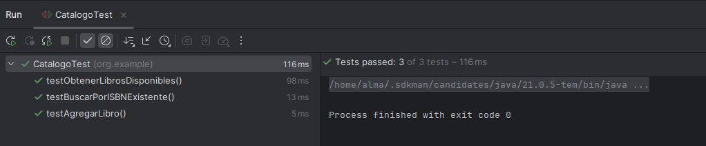
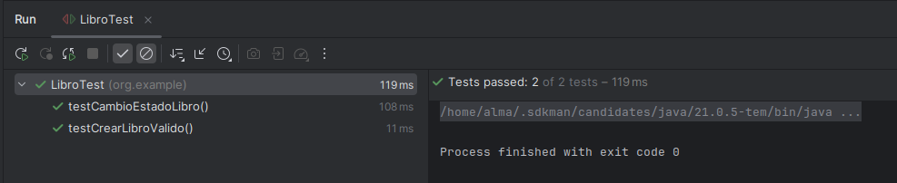
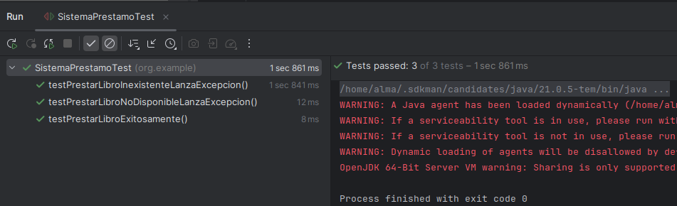
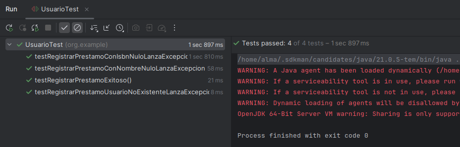

[](https://classroom.github.com/a/jpLeSJQi)
# Sistema de Gestión de Biblioteca - Práctica de Testing


## Tiempo Estimado y Recomendaciones
- **Tiempo estimado de realización:** 15 horas
- **Recomendación:** Se sugiere leer la consigna completa antes de comenzar con el desarrollo para tener una visión general del proyecto y planificar adecuadamente el trabajo.

## Identificación del Alumno
- **Nombre:** [Alma]
- **Apellido:** [Quinteros]
- **Legajo:** [62016]

# 📚 Sistema de Gestión de Préstamos de Libros

## 1. Código fuente implementado

- **Libro**: Representa un libro con atributos ISBN, título, autor y estado (DISPONIBLE o PRESTADO).
- **Catalogo**: Permite agregar libros, buscar libros por ISBN y listar todos los libros disponibles.
- **Prestamo**: Representa el préstamo de un libro en una fecha determinada.
- **SistemaPrestamo**: Gestiona el proceso de préstamo de libros a partir de un catálogo.
- **Usuario**: Representa un usuario con un historial de préstamos realizados.
- **GestionUsuarios**: Permite registrar usuarios, buscar usuarios y registrar préstamos para usuarios.

---

## 2. Pruebas unitarias correspondientes

Se implementaron pruebas unitarias utilizando **JUnit 5** y **Mockito** para:

- **LibroTest**: 
  - Creación de libros válidos.
  - Cambio de estado del libro (DISPONIBLE → PRESTADO).
- **CatalogoTest**:
  - Agregar múltiples libros.
  - Búsquedas exitosas y fallidas por ISBN.
- **SistemaPrestamoTest**:
  - Flujo de préstamo de libros usando mocks.
  - Manejo de libros no disponibles o inexistentes.
- **GestionUsuariosTest**:
  - Registro y búsqueda de usuarios.
  - Asignación de préstamos a usuarios.
  - Manejo de usuarios no encontrados o datos inválidos.

Frameworks usados:
- **JUnit 5** para la creación de pruebas.
- **Mockito** para el mockeo de dependencias (`Catalogo`, `SistemaPrestamo`).

---

## 3. Documentación de las funciones implementadas y su propósito

### 📚 Libro
- **Constructor `Libro(String isbn, String titulo, String autor)`**: 
  - Inicializa un libro como DISPONIBLE por defecto.
  - Se implementó para crear instancias de libros cargando datos mínimos obligatorios.

- **Métodos `getISBN()`, `getTitulo()`, `getAutor()`, `getEstado()`, `setEstado()`**:
  - Usados para acceder y modificar los atributos del libro de forma segura.

---

### 📚 Catalogo
- **`agregarLibro(Libro libro)`**:
  - Permite agregar nuevos libros al catálogo de forma controlada.
- **`buscarPorISBN(String isbn)`**:
  - Implementado para buscar un libro específico, dado su ISBN, para operaciones de préstamo.
- **`obtenerLibrosDisponibles()`**:
  - Se utilizó `stream()` y `filter()` para listar solo los libros que estén DISPONIBLES de forma eficiente.

---

### 📚 Prestamo
- **Constructor `Prestamo(Libro libro)`**:
  - Se implementó para encapsular la acción de prestar un libro, guardando su fecha de préstamo automáticamente.
- **Métodos `getLibro()`, `getFecha()`**:
  - Permiten acceder al libro prestado y a la fecha del préstamo.

---

### 📚 SistemaPrestamo
- **`prestarLibro(String isbn)`**:
  - Cambiado para devolver un objeto `Prestamo` en vez de `boolean`, facilitando el control del préstamo real (permite asociarlo directamente al usuario).
  - Lanza:
    - **`IllegalArgumentException`** si el libro no existe.
    - **`LibroNoDisponibleException`** si el libro ya está prestado.

- **`buscarPrestamoPorISBN(String isbn)`**:
  - Permite localizar un préstamo realizado, útil para validaciones y reportes.

---

### 📚 Usuario
- **Constructor `Usuario(String nombre)`**:
  - Inicializa un usuario vacío con su historial de préstamos listo para registrar.
- **`agregarPrestamo(Prestamo prestamo)`**:
  - Implementado para guardar los préstamos que realiza un usuario.

---

### 📚 GestionUsuarios
- **`registrarUsuario(String nombre)`**:
  - Agrega usuarios nuevos permitiendo su futura asociación con préstamos.
- **`buscarUsuario(String nombre)`**:
  - Implementado usando `Stream` para buscar usuarios de forma rápida y segura (ignorando mayúsculas/minúsculas).
- **`registrarPrestamo(String nombreUsuario, Prestamo prestamo)`**:
  - Se implementó para vincular un préstamo a un usuario ya registrado.
  - Lanza:
    - **`UsuarioNoEncontradoException`** si el usuario no existe.
    - **`IllegalArgumentException`** si alguno de los datos es `null`.

---

### 📚 Excepciones Personalizadas
- **`UsuarioNoEncontradoException`**:
  - Creada para representar de forma clara cuando un usuario no existe al intentar registrar un préstamo.
- **`LibroNoDisponibleException`**:
  - Creada para informar de manera específica cuando un libro ya está prestado y no puede ser solicitado nuevamente.

---

## 🛠️ Razones generales de las decisiones tomadas

- Usar objetos (`Prestamo`) en lugar de `boolean` permitió hacer el flujo de préstamo **más robusto y real**.
- Usar excepciones específicas hizo el sistema **más entendible y mantenible** frente a errores.
- Separar las responsabilidades en clases pequeñas ayudó a **cumplir los principios SOLID**, especialmente el de **Responsabilidad Única** (Single Responsibility Principle).
- El uso de **Mockito** en los tests permite probar las clases **aisladas**, sin depender de las otras clases reales.

---

## 4. Evidencia de que las pruebas pasan correctamente

Resultado de la ejecución de los tests: 






## Importante
- La rama `main` está protegida y no se pueden hacer commits directos sobre ella
- Todo el trabajo debe realizarse en ramas feature siguiendo el patrón `feature/issue-numero-descripcion`
- Los cambios deben ser enviados mediante Pull Requests
- Cada Pull Request debe estar asociado a un Issue específico

## Objetivo
Este proyecto tiene como objetivo que los estudiantes practiquen y desarrollen habilidades en testing unitario utilizando JUnit5 y Mockito en Java. A través de la implementación de un sistema de gestión de biblioteca, los estudiantes aprenderán a escribir pruebas unitarias efectivas y a utilizar mocks para simular dependencias.

## Requisitos Previos
- Java 21 o superior
- Maven
- Conocimientos básicos de Java y programación orientada a objetos

## Estructura del Proyecto
El proyecto está dividido en etapas incrementales, cada una enfocada en diferentes aspectos del testing. Cada etapa corresponde a un milestone en GitHub.

### Milestone 1: Configuración Inicial y Pruebas Básicas
**Objetivos de Aprendizaje:**
- Familiarizarse con la configuración de un proyecto Maven
- Aprender a escribir pruebas unitarias básicas con JUnit5
- Entender el concepto de assertions y su uso

**Issues Sugeridos:**
1. #1 Configuración inicial del proyecto Maven
2. #2 Implementación de la clase Libro
3. #3 Pruebas unitarias básicas para Libro

**Tareas:**
1. Configurar el proyecto Maven con las dependencias necesarias
2. Implementar la clase `Libro` con los siguientes atributos:
   - ISBN (String)
   - Título (String)
   - Autor (String)
   - Estado (Enum: DISPONIBLE, PRESTADO)
3. Escribir pruebas unitarias para:
   - Creación de un libro con datos válidos
   - Cambio de estado del libro

**Ejemplo de Guía:**
```java
@Test
void testCrearLibroValido() {
    Libro libro = new Libro("978-3-16-148410-0", "Clean Code", "Robert C. Martin");
    assertEquals("978-3-16-148410-0", libro.getIsbn());
    assertEquals("Clean Code", libro.getTitulo());
    assertEquals("Robert C. Martin", libro.getAutor());
    assertEquals(Estado.DISPONIBLE, libro.getEstado());
}
```

### Milestone 2: Implementación del Catálogo
**Objetivos de Aprendizaje:**
- Practicar el uso de colecciones en Java
- Aprender a escribir pruebas para métodos que manejan colecciones

**Issues Sugeridos:**
1. #4 Implementación de la clase Catalogo
2. #5 Pruebas para métodos de búsqueda

**Tareas:**
1. Implementar la clase `Catalogo` con los siguientes métodos:
   - Agregar libro
   - Buscar libro por ISBN
   - Obtener todos los libros disponibles
2. Escribir pruebas unitarias que incluyan:
   - Pruebas con múltiples libros
   - Búsquedas exitosas y fallidas

**Ejemplo de Guía:**
```java
@BeforeEach
void setUp() {
    catalogo = new Catalogo();
    libro1 = new Libro("978-3-16-148410-0", "Clean Code", "Robert C. Martin");
    libro2 = new Libro("978-0-13-235088-4", "Clean Architecture", "Robert C. Martin");
    catalogo.agregarLibro(libro1);
    catalogo.agregarLibro(libro2);
}

@Test
void testBuscarPorIsbn() {
    Libro libro = catalogo.buscarPorIsbn("978-3-16-148410-0");
    assertNotNull(libro);
    assertEquals("Clean Code", libro.getTitulo());
}
```

### Milestone 3: Sistema de Préstamos
**Objetivos de Aprendizaje:**
- Aprender a usar Mockito para simular dependencias
- Practicar el uso de mocks en pruebas unitarias

**Issues Sugeridos:**
1. #6 Implementación de la clase Prestamo
2. #7 Implementación de SistemaPrestamos
3. #8 Pruebas con mocks

**Tareas:**
1. Implementar las clases:
   - `Prestamo` (fecha de préstamo, libro)
   - `SistemaPrestamos` (gestión de préstamos)
2. Escribir pruebas que utilicen mocks para:
   - Simular el catálogo de libros
   - Probar el flujo de préstamo

**Ejemplo de Guía:**
```java
@Mock
private Catalogo catalogo;

@InjectMocks
private SistemaPrestamos sistemaPrestamos;

@Test
void testPrestarLibro() {
    Libro libro = new Libro("978-3-16-148410-0", "Clean Code", "Robert C. Martin");
    when(catalogo.buscarPorIsbn("978-3-16-148410-0")).thenReturn(libro);
    
    Prestamo prestamo = sistemaPrestamos.prestarLibro("978-3-16-148410-0");
    
    assertNotNull(prestamo);
    verify(catalogo).buscarPorIsbn("978-3-16-148410-0");
    assertEquals(Estado.PRESTADO, libro.getEstado());
}
```

### Milestone 4: Sistema de Usuarios
**Objetivos de Aprendizaje:**
- Practicar el uso de múltiples mocks en una prueba
- Aprender a manejar excepciones en pruebas

**Issues Sugeridos:**
1. #9 Implementación de la clase Usuario
2. #10 Implementación de GestionUsuarios
3. #11 Pruebas con múltiples mocks

**Tareas:**
1. Implementar las clases:
   - `Usuario` (nombre, historial de préstamos)
   - `GestionUsuarios` (registro de usuarios)
2. Escribir pruebas que:
   - Utilicen múltiples mocks
   - Prueben el manejo de excepciones

**Ejemplo de Guía:**
```java
@Mock
private Catalogo catalogo;

@Mock
private SistemaPrestamos sistemaPrestamos;

@InjectMocks
private GestionUsuarios gestionUsuarios;

@Test
void testRegistrarPrestamo() {
    Usuario usuario = new Usuario("usuario1");
    Libro libro = new Libro("978-3-16-148410-0", "Clean Code", "Robert C. Martin");
    
    when(catalogo.buscarPorIsbn("978-3-16-148410-0")).thenReturn(libro);
    when(sistemaPrestamos.prestarLibro("978-3-16-148410-0"))
        .thenReturn(new Prestamo(libro));
    
    gestionUsuarios.registrarPrestamo("usuario1", "978-3-16-148410-0");
    
    verify(sistemaPrestamos).prestarLibro("978-3-16-148410-0");
    assertEquals(1, usuario.getHistorialPrestamos().size());
}
```

## Entregables
Cada etapa debe ser entregada a través de un Pull Request que incluya:
1. Código fuente implementado
2. Pruebas unitarias correspondientes
3. Documentación de los cambios realizados
4. Evidencia de que las pruebas pasan correctamente

## Consideraciones Éticas sobre el Uso de IA
El uso de Inteligencia Artificial (IA) como herramienta de asistencia en el desarrollo de software es una práctica cada vez más común. Sin embargo, es importante considerar los siguientes aspectos éticos:

1. **Transparencia y Honestidad**
   - Declarar el uso de IA en el desarrollo del trabajo
   - Documentar cómo se utilizó la IA como herramienta de asistencia
   - No presentar código generado por IA como propio sin revisión y comprensión

2. **Aprendizaje y Comprensión**
   - La IA debe ser utilizada como una herramienta de aprendizaje, no como un reemplazo del pensamiento crítico
   - Es fundamental entender el código generado y las pruebas implementadas
   - El estudiante debe ser capaz de explicar y justificar las decisiones tomadas

3. **Responsabilidad**
   - El estudiante es responsable final de la calidad y corrección del código
   - Las pruebas deben ser verificadas y validadas personalmente
   - El código debe ser revisado y comprendido antes de su entrega

4. **Uso Apropiado**
   - La IA debe ser utilizada para asistir en el aprendizaje, no para evadir el proceso de desarrollo
   - Las consultas a la IA deben ser específicas y enfocadas en el aprendizaje
   - No se debe depender exclusivamente de la IA para resolver problemas

5. **Integridad Académica**
   - El trabajo final debe reflejar el aprendizaje y comprensión del estudiante
   - La IA es una herramienta de asistencia, no un sustituto del aprendizaje
   - Se espera que el estudiante demuestre su comprensión de los conceptos a través de su implementación

## Recursos Adicionales
- [Documentación de JUnit5](https://junit.org/junit5/docs/current/user-guide/)
- [Documentación de Mockito](https://javadoc.io/doc/org.mockito/mockito-core/latest/org/mockito/Mockito.html)
- [Guía de Maven](https://maven.apache.org/guides/)